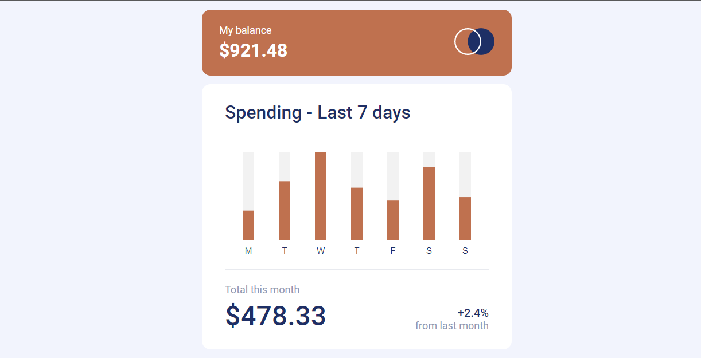

  
   
   

  <h2 align="center">Dashboard chart</h2>

  Dashboard chart build using HTML, CSS, and JavaScript.

  <a href="https://kurtismail.github.io/dashboard_app/"><strong>➥ Live Demo</strong></a>

 

### Demo Screeshots

### Prerequisites

Before you begin, ensure you have met the following requirements:

* [Git](https://git-scm.com/downloads "Download Git") must be installed on your operating system.

### Run Locally

To run **Dashboard chart** locally, run this command on your git bash:

### Contact

If you want to contact with me you can reach me at [Github](https://github.com/kurtismail/dashboard_app.git).

### License

This project is **free to use** and does not contains any license.
